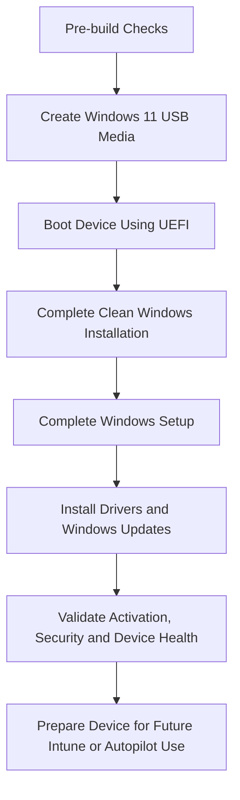

# Windows 11 Clean Build Flow

```mermaid
flowchart TD
    A[Pre-build Checks]
    B[Create Windows 11 USB Media]
    C[Boot Device Using UEFI]
    D[Complete Clean Windows Installation]
    E[Complete Windows Setup]
    F[Install Drivers and Windows Updates]
    G[Validate Activation, Security and Device Health]
    H[Prepare Device for Future Intune or Autopilot Use]

    A --> B
    B --> C
    C --> D
    D --> E
    E --> F
    F --> G
    G --> H
```
